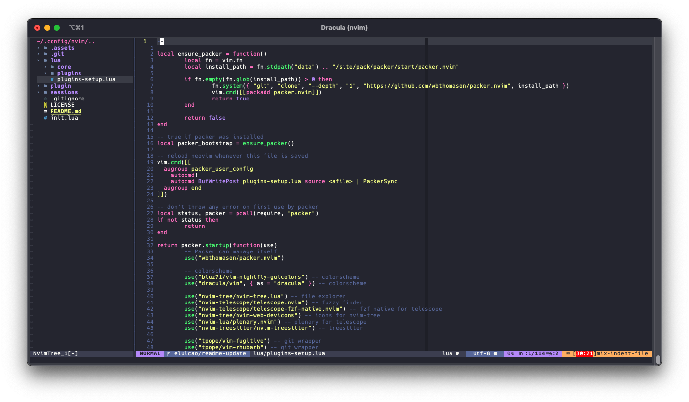

  

<h2 align="center" style="margin-top: 0px;">NeoVim Lua configuration</h2>

  

---

NeoVim Lua configuration is a simple set of files to configure NeoVim with ease.

Feel free to use it as a base for your own configuration.

  
